<h1 align="center">Hi 👋, I'm Artem @thelok1s </h1>
<h3 align="center">Fullstack web developer on TypeScript and Python. Web application security and cybersecurity bachelor.</h3>

 
   
  

## 🚀 Languages and ecosystem

  

## 🛠 Frameworks and libraries 

  

## ⚙️ Development tools and infrastructure

  

## 📌 Design, documentation, project managment

  

-----
 

  </img>
  </img>

